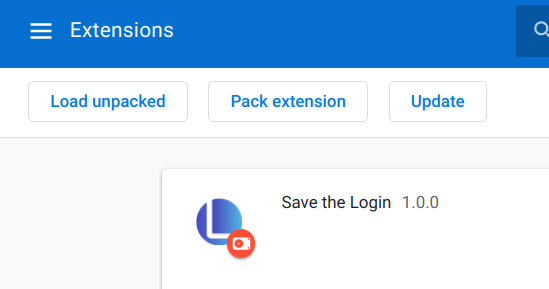

# stl plugin

- [Chrome Web Store](https://chrome.google.com/webstore/detail/save-the-login/olhdcmdedheoafealgdlignhohemkokh)
- [Official Website](https://savethelogin.world/)

## Requirement

- Google Chrome
- yarn (build only)
  - Linux:
    ```
    sudo apt-get update && sudo apt-get install nodejs npm
    sudo npm install -g yarn
    ```
  - Mac:
    ```
    brew install node
    sudo npm install -g yarn
    ```
  - Windows:
    - Download installer from http://www.nodejs.org/
    - <kbd>window</kbd> + <kbd>R</kbd> > cmd > npm, `npm install -g yarn`

## Documentation

`make docs`

## Install without build

Download plugin from releases.

[Releases](https://gitlab.com/savethelogin/savethelogin/-/releases)

## Installation

1. Clone, build project.

```sh
git clone https://gitlab.com/savethelogin/savethelogin.git
cd savethelogin
yarn install && yarn run build
```

2. Open chrome, move to extensions page.

```
chrome://extensions
```

3. Enable Developer mode at top-right corner.


4. Load dist extension directory.

```
savethelogin/dist
```


